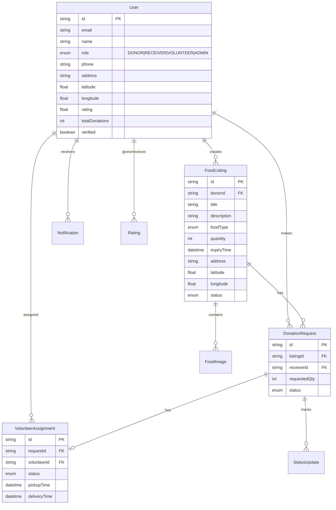

# FoodSaver - Food Waste Management Platform

A comprehensive food donation platform connecting donors (restaurants, households, events) with receivers (NGOs, shelters, individuals) through volunteer-driven pickup and delivery.

---

## Technology Stack

### Frontend
| Technology | Purpose |
|------------|---------|
| **Next.js 14** | React framework with App Router, SSR, API routes |
| **TypeScript** | Type safety and better DX |
| **Tailwind CSS** | Utility-first CSS framework |
| **Shadcn/ui** | Accessible component library |
| **Leaflet/Mapbox** | Interactive maps |
| **Socket.io** | Real-time notifications |

### Backend
| Technology | Purpose |
|------------|---------|
| **Next.js API Routes** | Backend API endpoints |
| **Prisma ORM** | Database access and migrations |
| **PostgreSQL** | Primary database |
| **NextAuth.js** | Authentication |
| **Cloudinary** | Image uploads |
| **Resend** | Email notifications |

---

## Database Schema



---

## Project Structure

```
foodsaver/
├── src/
│   ├── app/
│   │   ├── (auth)/           # Login, Register pages
│   │   ├── (dashboard)/      # Protected user routes
│   │   ├── (public)/         # Public pages
│   │   ├── admin/            # Admin panel
│   │   └── api/              # API routes
│   ├── components/
│   ├── lib/
│   ├── hooks/
│   └── types/
├── prisma/
└── public/
```

---

## Implementation Phases

| Phase | Focus | Duration |
|-------|-------|----------|
| 1 | Foundation & Setup | 1 day |
| 2 | Authentication | 1 day |
| 3 | Food Listings | 2 days |
| 4 | Donation Management | 1 day |
| 5 | Pickup & Delivery | 1 day |
| 6 | Notifications | 1 day |
| 7 | Safety & Quality | 0.5 day |
| 8 | Impact Tracking | 0.5 day |
| 9 | Ratings & Feedback | 0.5 day |
| 10 | Admin Panel | 1 day |

**Total: ~10 days**
